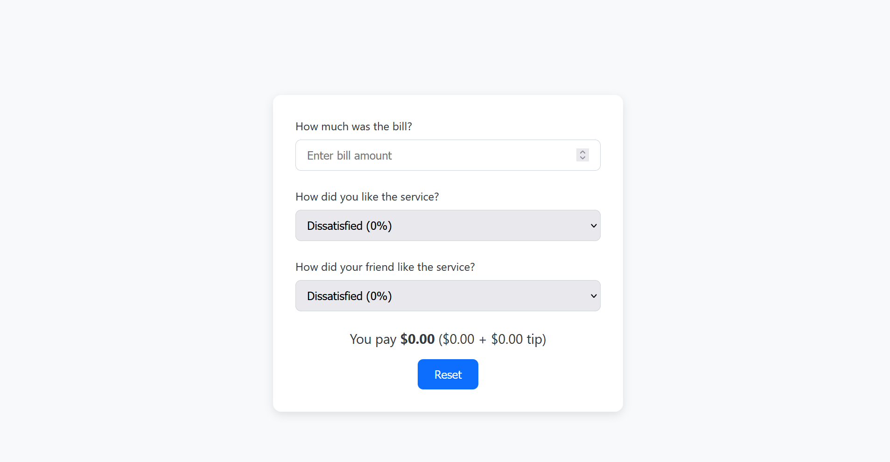

# 💸 Tip Calculator React App

A simple and modern React application to calculate tips and split the bill based on service ratings from you and your friend. The app is fully responsive, user-friendly, and built with clean, maintainable code.

---

## 📸 Screenshot

> Make sure to place a file named `screenshot.png` in the root directory of your project. You can use a real screenshot of your running app.

---

## 🛠️ Features

- 💵 Enter the bill amount
- 🧑 Rate your service experience
- 👥 Rate your friend’s experience
- 🧮 Calculate the total including tip
- 🔁 Reset the inputs easily
- 📱 Fully responsive and clean UI

---

## 🧑‍💻 Tech Stack

- **React.js** – Front-end UI library
- **CSS** – Custom responsive styling
